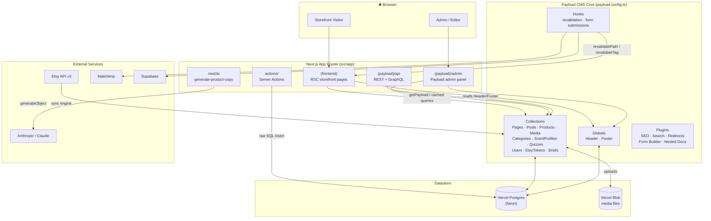
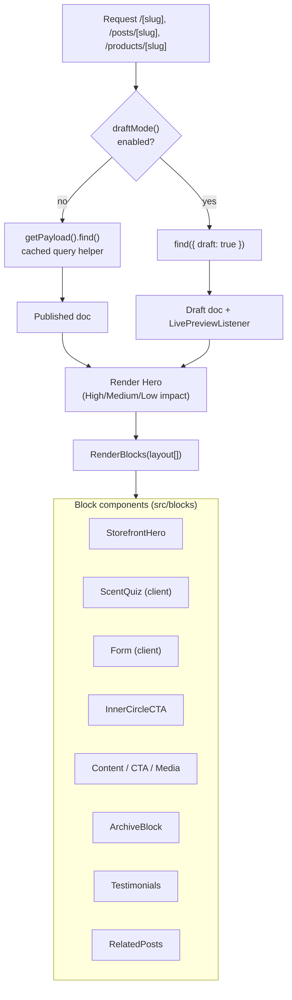
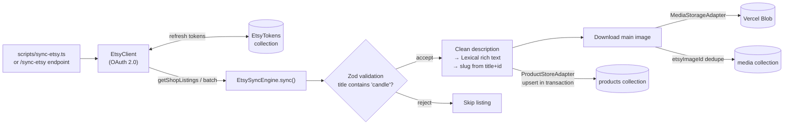
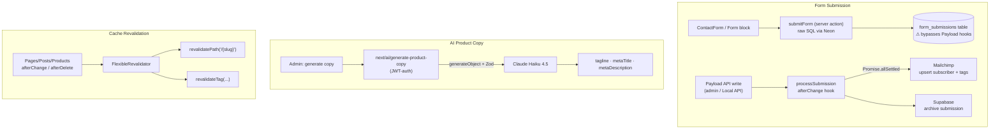
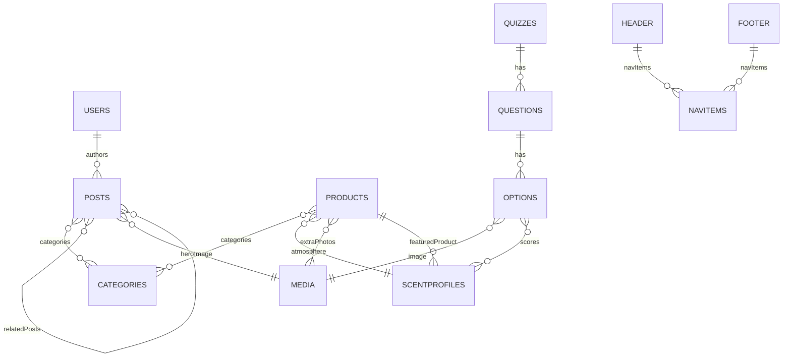

# Candera Architecture

Candera is a botanical candle storefront built on **Payload CMS** (headless backend + admin) and **Next.js App Router** (server-rendered storefront), with a deep **Etsy sync engine**, AI-assisted product copy, and email/archival integrations.

- **Database:** Vercel Postgres (Neon) via `@payloadcms/db-vercel-postgres`
- **Media storage:** Vercel Blob
- **Editor:** Lexical rich text
- **External services:** Etsy API v3, Anthropic (Claude), Mailchimp, Supabase

---

## 1. System Overview

How the major pieces connect — visitors, the Next.js app, Payload CMS, the datastore, and external services.

---

## 2. Storefront Request & Rendering Flow

Pages are React Server Components. Data is fetched from Payload with `React.cache()` + tag-based caching, and the layout is assembled from a block array.

**Key route map (`src/app/(frontend)`):**

| Route | Purpose |
|---|---|
| `/[slug]` | CMS pages (home = `home`), block-driven layout |
| `/posts` · `/posts/[slug]` | Blog archive + post detail |
| `/products` · `/products/[slug]` | Product archive (filter/sort/paginate) + detail |
| `/contact` | Contact form → `submitForm` server action |
| `/inner-circle` | Email signup |
| `/search` | Full-text search over posts |
| `/(sitemaps)` | XML sitemaps |

---

## 3. Etsy Sync Engine

`src/utilities/syncEtsy.ts` uses a port–adapter design: domain logic is decoupled from the Etsy client, the product store, and media storage. Listings are validated with Zod, cleaned, converted to Lexical, and upserted transactionally.

External Etsy API: `ETSY_API_KEY`, `ETSY_SHARED_SECRET`, `ETSY_REDIRECT_URI`. OAuth flow handled at `/etsy/oauth/*`; vacation mode via `/etsy/set-vacation`.

---

## 4. Forms, AI & Revalidation

Three event-driven flows that fan out from content/form changes.

**Note:** the storefront `submitForm` server action writes directly to `form_submissions` via raw SQL, so it bypasses Payload's collection hooks — the `processSubmission` `afterChange` hook (and its Mailchimp/Supabase fan-out) only runs for submissions created through Payload's API (e.g. the admin panel or Local API).

**Search:** the Search plugin indexes published posts into a `search` collection via `beforeSyncWithSearch` (`src/search/beforeSync.ts`); `src/lib/queries/search.ts` runs ILIKE queries against it through the Neon SQL client.

---

## 5. Core Data Model

Relationships between the main collections.

The **ScentQuiz** ties it together: quiz options carry weighted scores toward ScentProfiles, and each ScentProfile maps to a featured Product — turning a quiz result into a product recommendation.
